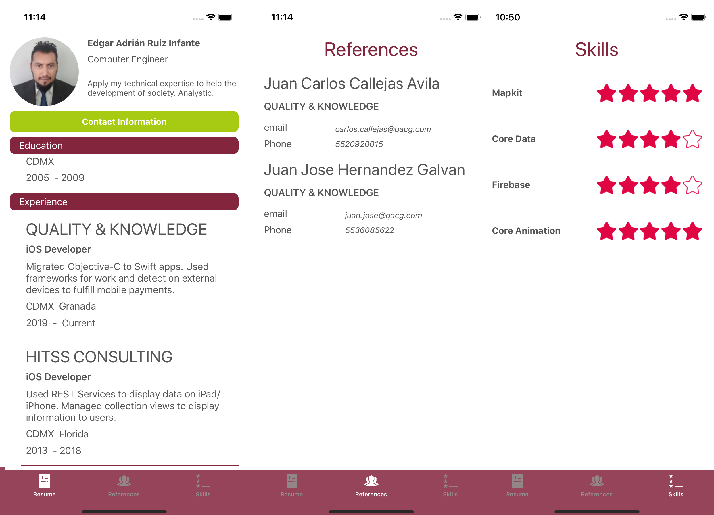

# Resume App

Is a simple iOS aplication to a resume divided into different sections to read easier, with a simple theme color, buttons, tab bars and a some animations effects in one view.

## Summary

This project was development to complete a code challenge. Used an gist repository to get my resume in a JSON file, that informations is shown in a table view divided into basic information, address, contact info, education and career history and his skills.

* Architecture: Model View Presenter
* JSON file: [Resume](https://gist.githubusercontent.com/globantUser/fb6eef6712f810ce58b0bdffd7f97ffe/raw)
* Swift version: 4.2
* Xcode version: 10.1

## Testing

+ Unit test
	+ In the unit testings, network services are tested. 
	+ It also checks that the parsed information of the JSON file is loaded correctly in the different fields of information.

+ UI test
	+ In the UI tests, it is verified that the elements of the basic information section exist, as well as the names of the other sections.
	+ Finally, the behavior of these sections is verified when tap on the expand or reduce buttons.

## Screenshots

